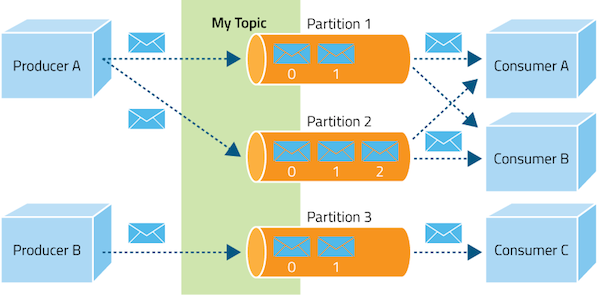

# Kafka

Kafka é uma plataforma de streaming de dados distribuída, usada para coletar, armazenar e processar grandes volumes de informações em tempo real. Ela funciona como um sistema de mensagens, onde produtores enviam dados (mensagens) para tópicos, e consumidores leem esses dados de forma rápida e escalável. É muito usado em sistemas que precisam de alta performance, confiabilidade e processamento contínuo, como monitoramento, análise de dados e integração entre serviços.

## Ref:
<https://kafka.apache.org/>\
<https://kafka.apache.org/quickstart>\
<https://kafka.apache.org/uses>\
<https://kafka.apache.org/documentation/>

## Componentes

### Producer (Produtor)
Envia mensagens para o Kafka, publicando dados em tópicos.

### Broker
Servidor que armazena e gerencia os dados recebidos dos produtores. O Kafka geralmente roda em clusters com vários brokers para garantir alta disponibilidade.

### Topic (Tópico)
Categoria ou canal onde as mensagens são organizadas e armazenadas. Cada mensagem publicada fica associada a um tópico.

### Partition (Partição)
Cada tópico pode ser dividido em várias partições para distribuir a carga e permitir paralelismo no consumo.

### Consumer (Consumidor)
Lê as mensagens dos tópicos, podendo ser um ou mais consumidores, que podem se agrupar em grupos para dividir o processamento.

### Zookeeper
Sistema usado para coordenar e gerenciar o cluster Kafka (controle de estado dos brokers, líderes, etc.).

