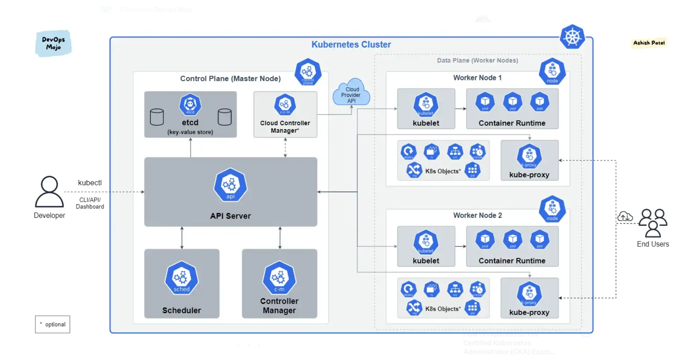

# Kubernetes (k8s)

Livro Online:

https://livro.descomplicandokubernetes.com.br/pt/

Documentação Oficial:

https://kubernetes.io/pt-br/docs/home/


## Conceitos

### Nó ou Worker:

Cada Servidor de um Cluster

###  Cluster:

Um conjunto de Nós que formam um Cluster

###  Control Plane:

Os componentes do plano de controle tomam decisões globais sobre o cluster (por exemplo, agendamento), bem como detectam e respondem a eventos de cluster (por exemplo, iniciando um novo POD quando o campo de uma implantação não estiver satisfeito)

###  POD:

Um container ou um conjunto de Containers com a mesma função

###  kubeadm:

Tool para realizar o bootstrap do Cluster

###  kubelet:

tool que roda em todos os nodes gerenciando os papéis, iniciando pods, containers e mantendo-os saudáveis

###  kubectl:

tool para realizar a comunicação com o Cluster e executar todas as operações de orquestração.


## Cluster Kubernets Componentes



https://kubernetes.io/docs/concepts/overview/components/

## Componentes Control Plane

- Kube-apiserver
- etcd
- kube-scheduler
- kube-controller-manager
- cloud-controller-manager

### Kube-Apiserver

O kube-apiserver é o componente principal do Kubernetes, e fornece uma interface para administração e gerenciamento do cluster através de uma API REST.
Ele é responsável por validar e processar as requisições dos usuários e aplicativos, além de manter o estado desejado do cluster.

### Kube-Controller-Manager

O kube-controller-manager é um componente do Kubernetes que gerencia os controladores responsáveis por garantir que o estado do cluster corresponda ao estado desejado. Ele inclui controladores como o de replicação, endpoints, serviços, entre outros.
O kube-controller-manager também detecta falhas nos nós do cluster e executa ações para recuperar o estado desejado.

### Kube-Scheduler

O kube-scheduler é um componente do Kubernetes responsável por determinar em qual nó do cluster um pod deve ser executado, com base em vários fatores, como recursos disponíveis, requisitos de hardware e software, politicas de tolerância a falhas, e restrições de afinidade e anti-afinidade. Ele faz isso avaliando as informações dos PODs e dos NODES disponíveis, selecionando o melhor NODE para a execução do POD.

### ETCD

O etcd armazena informações criticas do cluster, como configurações, metadados de objetos Kubernetes e estado do serviço. O etcd é altamente escalável, permitindo que os usuários adicionem ou removam NODES do cluster conforme necessário, e é projetado para ser tolerante a falhas, garantindo a integridade dos dados mesmo em caso de interrupções do sistema.

## Componentes do Node

- Kubelet
- Kube-proxy
- Container Runtime

### Kubelet

O kubelete é um componente do Kubernetes que roda em cada NODE do cluster e é responsável por gerenciar os containers que são executados nele. Ele recebe instruções do kube-apiserver sobre quais containers devem ser executados em cada NODE e garante que eles estejam em execução e saudáveis. O kubelet também se comunica com o kube-apiserver para reportar o estado dos containers em execução e os recursos disponíves no NODE.

### Kubeproxy

O kube-proxy é um componente do Kubernetes que atua como um proxy de rede e um balanceador de carga para os serviços que são expostos para o mundo exterior do cluster.

## Certificações:

- CKA
- CKS
- CKD


## Comandos mais usados

<https://kubernetes.io/docs/reference/kubectl/cheatsheet/>\
<https://kubernetes.io/docs/reference/generated/kubectl/kubectl-commands>


## Padrão de manifesto

```
apiVersion:
kind:
metadata:
  name: 
spec:
```

